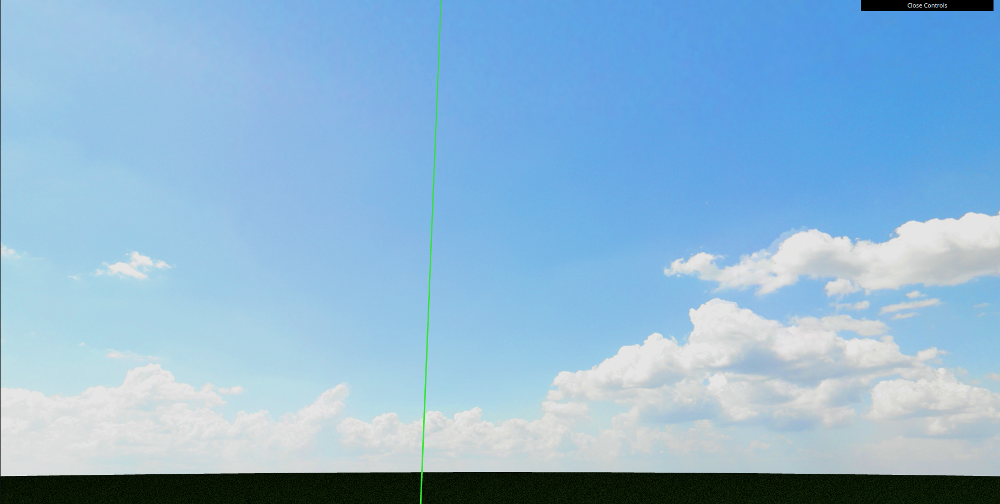
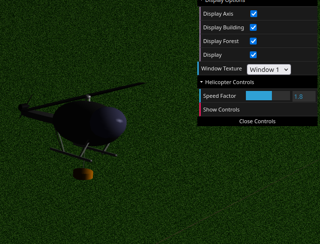

# CG 2024/2025

## Group T01G11

## Project

### Screenshots

`Figure 1: Panorama`

---

`Figure 2: Fire Station Building`

---

`Figure 3: Forest`

---

`Figure 4: Helicopter`

---

`Figure 5: Helicopter flying`

---

`Figure 6: Helicopter extinguishing the fire`

---

`Figure 7: Fire With Animation`

---

`Figure 8: Helipad maneuvering (animation made with shaders)`

---

### Group Members

| Name                               | Number    | E-Mail            |
| ---------------------------------- | --------- | ----------------- |
| Diogo Miguel Fernandes Ferreira    | 202205295 | up202205295@up.pt |
| Xavier dos Santos Portugal Martins | 202206632 | up202206632@up.pt |
